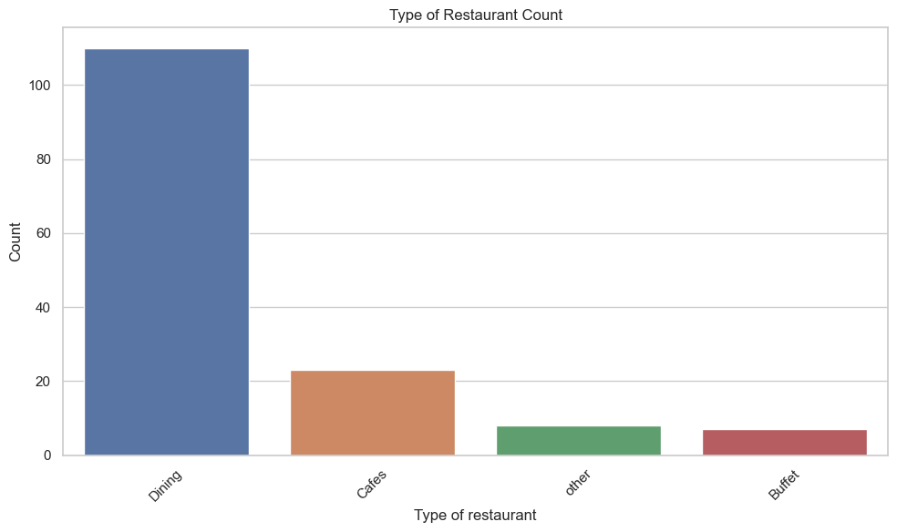
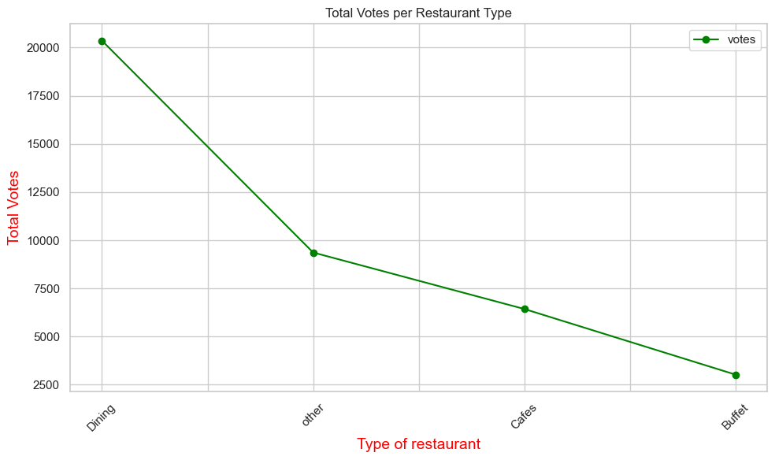
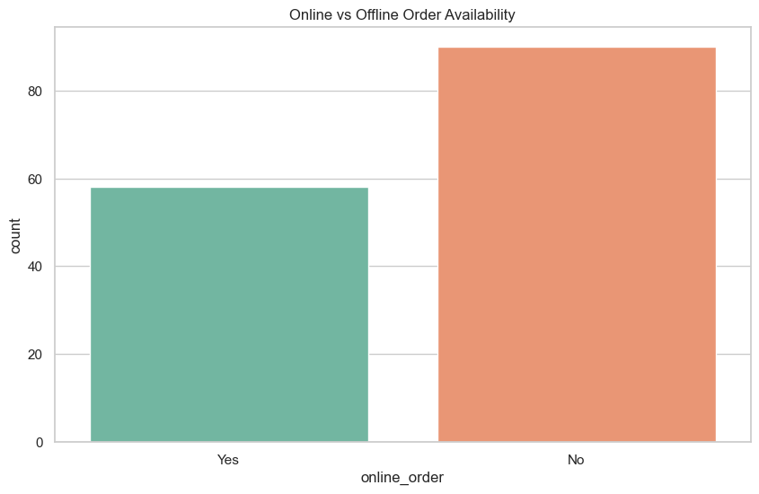
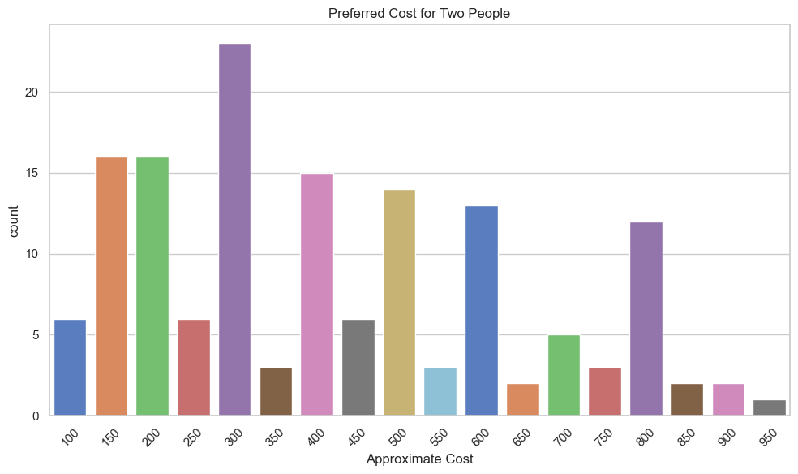
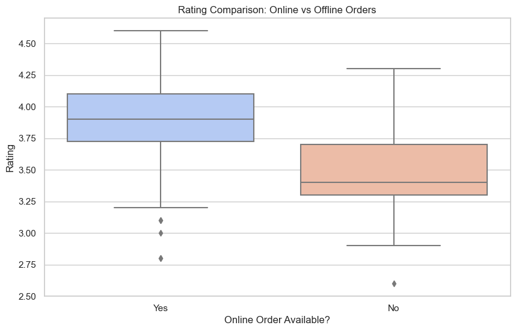
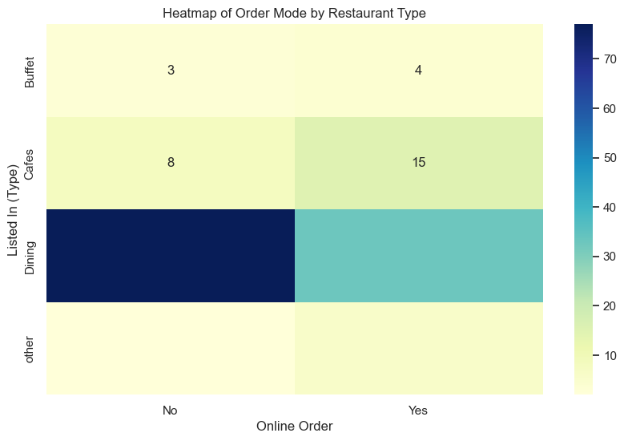
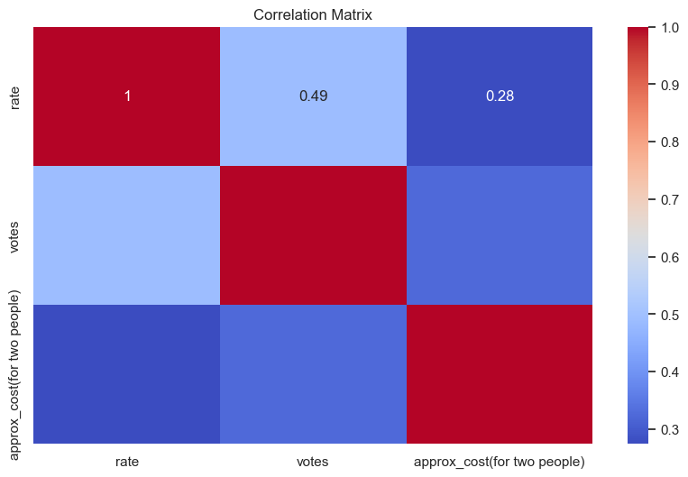

# 🍽️ Swiggy Data Analysis

This project analyzes restaurant data from Swiggy, exploring trends in customer ratings, cost, online order availability, and restaurant types. It uses **Plotly**, **Pandas**, and **Matplotlib** to create interactive and insightful visualizations.

---


## 📊 Key Visualizations

| Visualization | Description |
|---------------|-------------|
| **Type of Restaurant Count** | Histogram showing the frequency of each restaurant category. |
| **Total Votes per Restaurant Type** | Line plot visualizing which categories receive the most customer engagement. |
| **Online vs Offline Orders** | Comparison of restaurants offering online vs offline orders. |
| **Ratings Distribution** | Histogram to explore how ratings are distributed. |
| **Cost for Two Distribution** | Histogram to identify common price brackets. |
| **Rating by Online Order Availability** | Boxplot comparing ratings based on online ordering availability. |
| **Heatmap of Order Mode by Restaurant Type** | Heatmap showing the correlation between online order availability and restaurant types. |
| **Correlation Matrix** | Heatmap displaying correlations between numeric features like ratings, votes, and cost. |

---

## ✅ New Features Added

| Feature | Description |
|---------|-------------|
| 📌 **Cost Cleaning** | Handles commas in cost fields for proper numeric conversion. |
| 📌 **Missing Data Handling** | Drops rows with invalid rate or cost values. |
| 📌 **Better Plots** | Clean titles, axis labeling, rotated ticks, and layout formatting. |
| 📌 **Correlation Heatmap** | Displays correlation between cost, rating, and votes. |
| 📌 **Budget Restaurants Filter** | Highlights top-rated restaurants with cost ≤ ₹500 and ratings ≥ 4.0. |
| 📌 **Modular Comments** | Sections are clearly defined and documented. |
| 📌 **Outlier Prevention** | Skips parsing errors with try/except in the ratings column. |


---
### 📊 Type of Restaurant Count


### 🔥 Total Votes per Restaurant Type


### 📦 Online vs Offline Order Availability


### ⭐ Ratings Distribution


### 💸 Cost Distribution


### 📦 Ratings by Online Order


### 🔥 Heatmap of Online Orders by Type


### Correlation Matrix



## 🛠️ Setup Instructions

### 1. Clone the Repository
```bash
git clone https://github.com/snehadindi/SwiggyDataAnalysis.git
cd SwiggyDataAnalysis
```

### 2. Install Dependencies
Make sure Python is installed (recommended: Python 3.8+), then run:
```bash
pip install -r requirements.txt
```

### 3. Run the Notebook
Launch Jupyter Notebook or JupyterLab:
```bash
jupyter notebook analysis.ipynb
```
